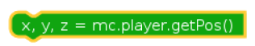

## Code Block Meanings

<table style = "width:100%">
  <tr>
    <th> Code Block </th>
    <th> Meaning </th>
  </tr>
  <tr>
    <td>   </td>
    <td> Importing the Minecraft library </td>
  </tr>
  <tr>
    <td>  </td>
    <td> Connects to Minecraft server </td>
  </tr>
  <tr>
    <td>  </td>
    <td> Allows you to post messages to chat </td>
  </tr>
  <tr>
    <td>  </td>
    <td> Finds your players position </td>
  </tr>
  <tr>
    <td>  </td>
    <td> Sets the players position within Minecraft </td>
  </tr>
  <tr>
    <td>  </td>
    <td> Sets the type of block </td>
  </tr>
  <tr>
    <td>  </td>
    <td> Importing the mcpi block library </td>
  </tr>
  <tr>
    <td>  </td>
    <td> Added parameter for special blocks </td>
  </tr>
  <tr>
    <td>  </td>
    <td> Placing multiple blocks at once </td>
  </tr>
  <tr>
    <td>  </td>
    <td> Importing the Python time library </td>
  </tr>
  <tr>
    <td>  </td>
    <td> Adding a while true loop to your program, all lines of code inside run while the function is true </td>
  </tr>
  <tr>
    <td>  </td>
    <td> Adding the sleep function from the time library. Makes the program pause for a given amount of time </td>
  </tr>
  <tr>
    <td>  </td>
    <td> Finding a type of block within Minecraft </td>
  </tr>
  <tr>
    <td>  </td>
    <td> Prints statement to screen </td>
  </tr>
  <tr>
    <td>  </td>
    <td> runs the code if the condition is true </td>
  </tr>
  <tr>
    <td>  </td>
    <td> else statement. If the first statement is false. The else statement will run. </td>
  </tr>
</table>
