# Getting Started
Minecraft is a popular sandbox open world building game. Minecraft comes pre installed on the Raspberry pi and also comes with a programming interface. This means you can write commands and scripts in Python code to build things within the game automatically.

## Running Minecraft
To run Minecraft go to Menu -> Games -> Minecraft pi.

Once Minecraft has loaded click on **Start Game** followed by **Create New**.

You are now in a game of Minecraft! You can walk around, hack and build things.

 

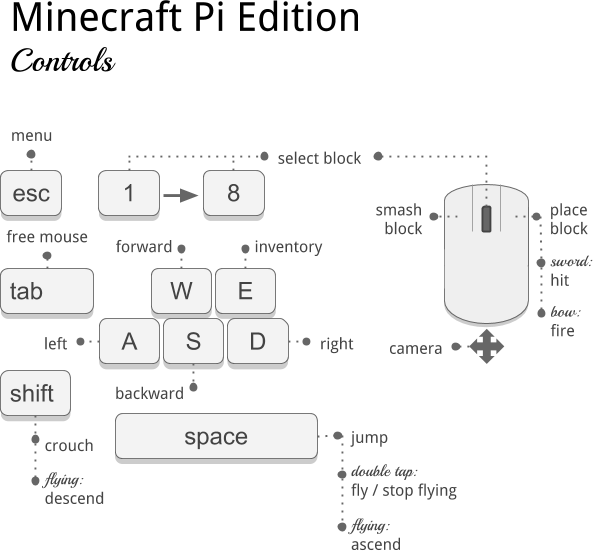

 

You can select an inventory item by using the scroll wheel on the mouse or using the numbers on the keyboard.

 
 

## Using EduBlocks
Press the **Tab** key to free the mouse. Now open the EduBlocks program by clicking on the Desktop icon.

### Hello World
Let's create our first program using EduBlocks.

Drag the following blocks from the Minecraft menu at the left hand side:

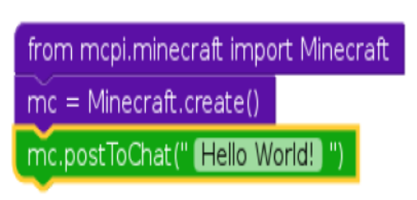

To run the program click on Run at the top of the screen. You should now see "Hello World!" on the screen within Minecraft.

### Teleporting

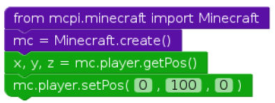

This will transport the player to 100 spaces in the air. This will mean you'll teleport to the middle of the sky and fall straight back down to where you started.

Try Teleporting somewhere else!

### Set Blocks
You can place a single block at a given set of coordinates with **mc.setBlock()**.

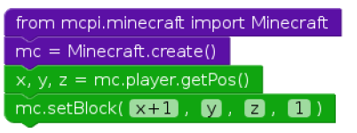

Try changing the block to something else.

### Special Blocks
There are some blocks which have extra properties, such as wool which has an extra setting where you can specify the colour. To set the colour use an optional fourth parameter in **setBlock**. For example:

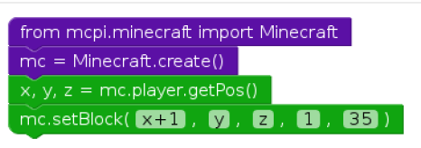

In this example the fourth parameter is **1** which sets the wool colour to orange. Without the fourth parameter it is set to the default **0** which is white. Some more colours are:  
2: Magenta  
3: Light Blue  
4: Yellow

Try some more numbers and watch the block change colour.

Other blocks which have extra properties are wood(**17**): oak, spruce, birch, etc; tall grass(**31**):shrub, grass, fern; torch(**50**):pointing east, west, north, south.

### Set Multiple Blocks
As well as setting a single block with **setBlock** you can fill in a volume of space in one go with **setBlocks**. For example:

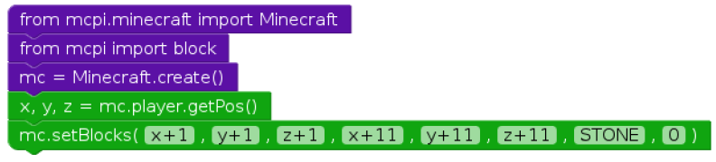

This will fill in a 10 x 10 x 10 cube of solid stone.

You can create bigger volumes with the **setBlocks** function but it may take longer to generate!

## Dropping Blocks as You Walk
Now you know how to drop blocks, lets use our moving location to drop blocks when you walk.

The following code will drop a flower behind you wherever you walk:

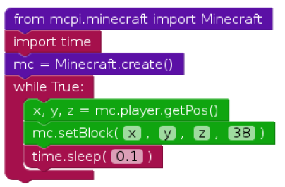

Now walk forward for a while and turn around to see the flowers you have left behind you. **NOTE:** The number 38 is the block reference for flower.

Since we used a **while True** loop this will go on forever. To stop it, hit **Ctrl + C** in the Python window.

Try flying through the air and see the flowers you leave in the sky.

## Playing with TNT
Another interesting block is TNT! To place a normal TNT block use:

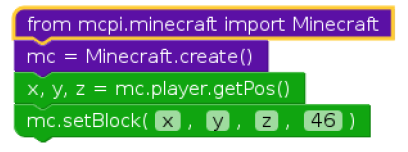

However, this TNT block is fairly boring. Try applying **data** as **1**. For example:

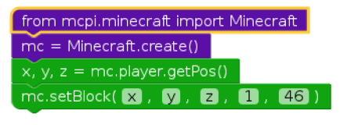

Now use your sword and left click the TNT block: it will be activated and will explode in a matter of seconds!

Now try making a cube of TNT blocks. For example:

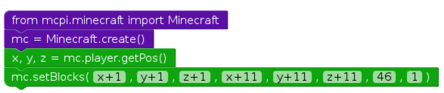

Now you'll see a big cube of TNT blocks. Go ahead and activate one of the blocks and then run away to watch the show! It'll be really slow to render the graphics as so many things are changing at once.

## Fun with Flowing Lava
One block that is a lot of fun to play with is flowing lava. For example:

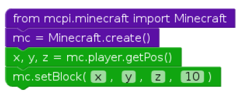

Find the block you've just placed, and you should see lava flowing from the block to the ground.

The cool thing about lava is that when it cools down it becomes rock. Move to another location in your world and try this:

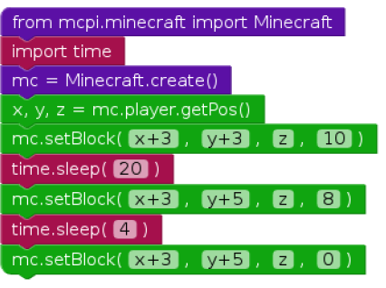

You can adjust the **sleep** parameters to allow more or less lava to flow.
