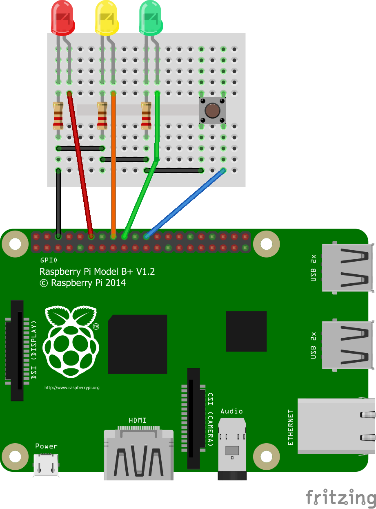

# Button Input

## Introduction
Within this tutorial you will learn how to wire and program a button for physical input.

## Equipment Required
You will require:
* Raspberry pi with all cables
* An Electronic Breadboard
* 1 x Red LED
* 1 x Yellow LED
* 1 x Green LED
* 1 x Push Button
* 3 x 300 ohms Resistors
* 5 x Male to Female jumper wires
* 3 x Pieces of hook-up wires

## Creating The Circuit
Before you create the circuit make sure the Raspberry Pi is turned off.
To create the circuit follow the diagram below:
**NOTE** LEDs Have one longer leg called the anode which is always connected to the positive supply of the circuit. The shorter leg called the cathode is connected to the negative side of the power supply. The resistors go in between the short leg and ground rail on a breadboard.



Now plug the power supply in to turn the Raspberry pi on.

## Lets Get Coding!
Your Raspberry Pi should now be booted up. Go to Menu -> Programming and click on the IDLE3 Python editor. To create a new file, go to File -> New File. Now type the following code:

**NOTE** Anything typed after a '#' is a comment in Python. Programmers use this to tell people reading the code (including themselves!) what is going on.

```python
from gpiozero import LED, Button
from signal import pause
import os

red = LED(18) # this is saying the red LED is connected to pin 18 on the raspberry pi
yellow = LED(23) # this is saying the yellow LED is connected to pin 23 on the raspberry pi
green = LED(24) # this is saying the green LED is connected to pin 24 on the raspberry pi
button = Button(25) # this is saying the button is connected to pin 25 on the raspberry pi

os.system('clear') # Clears the screen

print ("Press the Button to turn the LED on and off")

button.when_pressed = red.on
button.when_released = red.off
```

Once you have typed all of the code above, and checked to make sure it is right, save the file and call it button_input.py

## Running The Code
You are now ready to run the code. You can do this by clicking on Run -> Run Module or by pressing F5 on your keyboard.

The screen will clear and you will be prompted to press the button. When you press the button the red LED will turn on.
