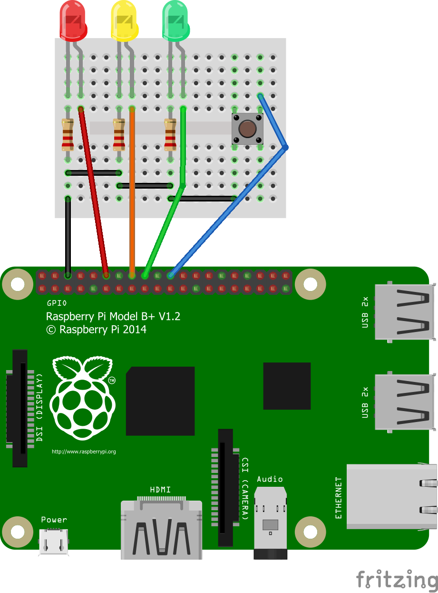
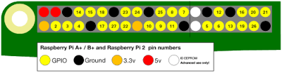

# Button Input

## Introduction
Within this tutorial you will learn how to wire and program a button for physical input.

## Equipment Required
You will require:
* Raspberry pi with all cables
* An Electronic Breadboard
* 1 x Red LED
* 1 x Yellow LED
* 1 x Green LED
* 1 x Push Button
* 3 x 300 ohms Resistors
* 5 x Male to Female jumper wires
* 3 x Pieces of hook-up wires

## Creating The Circuit
Before you create the circuit make sure the Raspberry Pi is turned off.
To create the circuit follow the diagram below:
**NOTE** LEDs Have one longer leg called the anode which is always connected to the positive supply of the circuit. The shorter leg called the cathode is connected to the negative side of the power supply. The resistors go in between the short leg and ground rail on a breadboard.




Now plug the power supply in to turn the Raspberry pi on.

## Lets Get Coding!
Your Raspberry Pi should now be booted up. Go to Menu -> Programming and click on the IDLE3 Python editor. To create a new file, go to File -> New File. Now type the following code:

**NOTE** Anything typed after a '#' is a comment in Python. Programmers use this to tell people reading the code (including themselves!) what is going on.

```python
# importing python libraries
from gpiozero import LED, Button
from signal import pause
import os

# Initialising raspberry pi pin numbers for LED's and button
red = LED(18)
yellow = LED(23)
green = LED(24)
button = Button(25)

# Printing instructions to screen
print ("What LED would you like to turn on? ")
print ("1: red?")
print ("2: yellow?")

# Taking user input and storing it as variable choice
choice = input("What LED would you like to turn on?")

# Changing user input from string (text) to integer (number)
choice = int(choice)

# Taking user input and storing it as LEDChoice variable
if choice == 1:
    print ("You picked the red LED")
    LEDChoice = red

if choice == 2:
    print ("You picked the Yellow LED")
    LEDChoice = yellow

# When the button is pressed turn chosen LED on
button.when_pressed = LEDChoice.on

# When the button is released turn chosen LED off
button.when_released = LEDChoice.off

pause()
```

Once you have typed all of the code above, and checked to make sure it is right, save the file and call it button_input.py

## Running The Code
You are now ready to run the code. You can do this by clicking on Run -> Run Module or by pressing F5 on your keyboard.

The screen will clear and you will be prompted to press the button. When you press the button the red LED will turn on.

## Challenge
Try adding an option to pick the green LED
