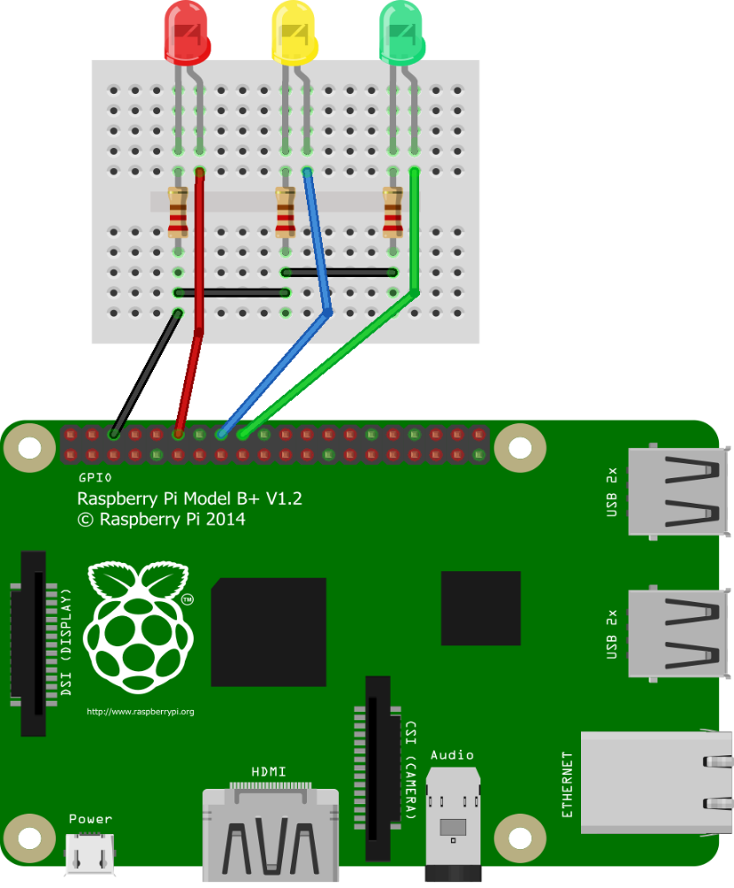

# Making LEDs Blink

## Introduction
Within this worksheet you are going to learn how to make LEDs blink using a Raspberry Pi and Scratch.

## Equipment We Will Be Using
To complete this worksheet you will require:
* A Raspberry Pi with all cables
* A Electronic Breadboard
* 1 x Red LED
* 1 x Yellow LED
* 1 x Green LED
* 3 x 330 ohms Resistors
* 4 x Male to Female jumper wires
* 2 x Pieces of hook-up wire

## Creating The Circuit
Before you create the circuit make sure the Raspberry Pi is turned off. To create the circuit follow the diagram below:
**NOTE:** LEDs Have one longer leg called the anode which is always connected to the positive supply of the circuit. The shorter leg called the cathode which is connected to the negative side of the power supply. The resistors go in between the short leg and ground rail on a breadboard.

Now plug the power supply in to turn the Raspberry pi on.

## Code
Your Raspberry Pi should now be booted up. Go to Menu -> Programming and click on Scratch. Now drag and drop the following blocks to crate your code:

## What The Blocks Do

<table style = "width:100%">
  <tr>
    <th> Code Block </th>
    <th> Meaning </th>
  </tr>
  <tr>
    <td>   </td>
    <td> When the green flag is clicked the code will run </td>
  </tr>
  <tr>
    <td>  </td>
    <td> Turning the GPIO Server on so that scratch can communicate with the GPIO Pins </td>
  </tr>
  <tr>
    <td>   </td>
    <td> Configuring pin 18 as an output </td>
  </tr>
  <tr>
    <td>  </td>
    <td> Configuring pin 23 as an output </td>
  </tr>
  <tr>
    <td>  </td>
    <td> Configuring pin 24 as an output </td>
  </tr>
  <tr>
    <td>  </td>
    <td> Giving pin 18 power and turning the red LED on </td>
  </tr>
  <tr>
    <td>   </td>
    <td> This makes the program pause for 1 second </td>
  </tr>
  <tr>
    <td>   </td>
    <td> Taking power away from pin 18 and turning the red LED off </td>
  </tr>
</table>  

**NOTE:** To edit the code of the broadcast blocks click on the little black arrow and pick *new/edit* and type the text into the dialog box and press enter.

Once you have copied the code above and checked to make sure it is right. Save the file and call it Blinking_LEDs.

## Running The Code
You are now ready to run the code. You can do this by clicking on the green flag. You should now see the red LED blink on and off twice.

## Challenge 1
You have managed to make the red LED blink. Now try and make the yellow and green blink too. Save your code and run it as before.

## Making LEDS Blink Forever

<table style = "width:100%">
  <tr>
    <th> Code Block </th>
    <th> Meaning </th>
  </tr>
  <tr>
    <td>  </td>
    <td> This makes your code loop forever or until the red dot is clicked. </td>
 </tr>
</table>

Now save your code as Blinking_LEDs_Forever and run it as before.

You should now see the red LED blink on and off forever. To make it stop click on the red dot.

## Challenge 2
You have made the red LED blink forever now do the same for the yellow and green LEDs. Save your code as before. You should now see all three LEDs blink on and off forever.
