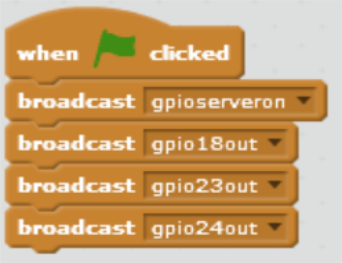
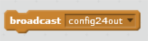
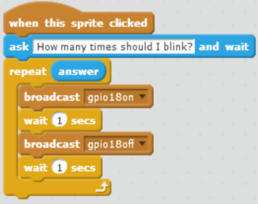

<link rel="stylesheet" type="text/css" href="C:/Users/kez/Documents/GitHub/DundeeRJam/Resources/mystyle.css">

# User Interaction
## Introduction
Within this worksheet we are going to control the red, yellow or the green LEDs depending on the choice that the user makes.

## Equipment Required
To complete this worksheet you will require:
* A Raspberry Pi with all cables
* A Electronic Breadboard
* 1 x Red LED
* 1 x Yellow LED
* 1 x Green LED
* 3 x 330 ohms Resistors
* 4 x Male to Female jumper wires
* 1 x Piece of hookup wire

## Creating The Circuit
Before you create the circuit make sure the Raspberry Pi is turned off.
To create the circuit follow the diagram below:
**NOTE:** LEDs Have one longer leg called the anode which is always connected to the positive supply of the circuit. The shorter leg called the cathode is connected to the negative side of the power supply. The resistors go in between the short leg and ground rail on a breadboard.

Now plug the power supply in to turn the Raspberry pi on.

## Creating User Interface
Before we write our code this time we need to develop an interface to pick which LED we would like to blink.

First thing we need to do is open Scratch. To do this Go to Menu -> Programming and click on Scratch.

1. **Delete Felix (the Cat)**. To do this right click on sprite 1 and click on Delete.
2. **Create a sprite for our question**. To do this click on the paintbrush Icon next to New Sprite. Then click on the "T" for creating text, type What LED would you like to blink?
3. **Create a Red square**. To do this click on the paintbrush Icon again and click on the black rectangle. Now click on the paint tin icon and pick the colour red, then click in the rectangle to make it Red. You can also add the text "Red" to your square too.
4. **Create a Yellow square**. Do this exactly the same as the Red square except fill it with a yellow colour.

Your interface should look something like this:

## Creating The Code
### **Configuring GPIO**
To configure scratch to talk to the GPIO pins double click on the stage icon and add the following code:

### **What The Blocks Do**
<table style = "width:100%">
  <tr>
    <th> Code Block </th>
    <th> Meaning </th>
  </tr>
  <tr>
    <td>  </td>
    <td> When the green flag is clicked the code will run </td>
  </tr>
  <tr>
    <td>  </td>
    <td> Turning the GPIO Server on so that scratch can communicate with the GPIO Pins </td>
  </tr>
  <tr>
    <td>  </td>
    <td>  Configuring pin 18 as an output </td>
  </tr>
  <tr>
    <td>  </td>
    <td>  Configuring pin 23 as an output </td>
  </tr>
  <tr>
    <td>  </td>
    <td>  Configuring pin 24 as an output </td>
  </tr>
<table>

### **Configuring The Red LED**
Double click on the Red sprite block and add this code:

### **What The Blocks Do**
<table style = "width:100%>
  <tr>
    <th> Code Block </th>
    <th> Meaning </th>
  </tr>
  <tr>
    <td> img src = "Images/Sprite_Clicked.png" width = "150px" height = "40px" /> </td>
    <td> When this sprite is clicked it does the code that follows </td>
  </tr>
  <tr>
    <td> img src = "Images/Ask_Wait.png" width = "150px" height = "40px" /> </td>
    <td> This allows you to ask a question and wait for a response </td>
  </tr>
  <tr>
    <td> img src = "Images/Repeat.png" width = "150px" height = "40px" /> </td>
    <td> This block makes the code inside it repeat a given number of times </td>
  </tr>
  <tr>
    <td> img src = "Images/Answer.png" width = "150px" height = "40px" /> </td>
    <td>  This stores the answer to a question. When attached to the repeat block the code will run that many times </td>
  </tr>
  <tr>
    <td> img src = "Images/18.on.png" width = "150px" height = "40px" /> </td>
    <td> Giving pin 18 power and turning the red LED on </td>
  </tr>
  <tr>
    <td> img src = "Images/Wait.png" width = "150px" height = "40px" /> </td>
    <td> This makes the program pause for 1 second </td>
  </tr>
  <tr>
    <td> img src = "Images/18_off.png" width = "150px" height = "40px" /> </td>
    <td> Taking power away from pin 18 and turning the red LED off </td>
  </tr>
</table>

### **Configuring The Yellow LED**
Double click on the Yellow sprite and add this code:

All the code for the Yellow sprite is the same as the Red Sprite apart from it is turning pin 23 on and off instead of pin 18.

**NOTE:** To edit the code of the broadcast blocks click on the little black arrow and pick *new/edit* and type the text into the dialog box and press enter.

Once you have copied the code above and checked to make sure it is right. Save the file and call it User_Interaction.

## Running The Code
You are now ready to run the code. You can do this by clicking on the green flag. You should now see your chosen LED blink on and off for as many times as you asked it.

## Challenge
Now you have got the Red and Yellow LEDs working. Add a green block and code to make this work for the green LED.
