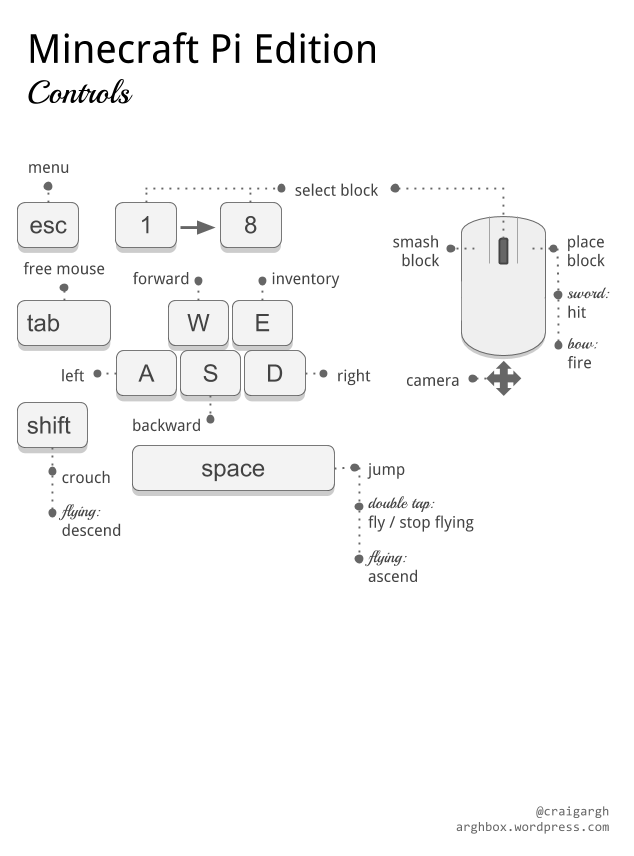

# Getting Started
Minecraft is a popular sandbox open world building game. Minecraft comes pre installed on the Raspberry pi and also comes with a programming interface. This means you can write commands and scripts in Python code to build things within the game automatically.

## Running Minecraft
To run Minecraft go to Menu -> Games -> Minecraft pi.

Once Minecraft has loaded click on **Start Game** followed by **Create New**.

You are now in a game of Minecraft! You can walk around, hack and build things.

### Controls



You can select an inventory item by using the scroll wheel on the mouse or using the numbers on the keyboard.

## Using Python
Press the **Tab** key to free the mouse. Now open the Python editor by going to Menu -> Programming -> Python3.

Create a file by going to File -> New File.

### Hello World

Type the following code:

```Python
from mcpi.minecraft import Minecraft # Importing the Minecraft library

mc = Minecraft.create ()

mc = postToChat ("Hello World!") # printing Hello world to Minecraft chat.
```
Now we need to save our program to do this go to File -> Save.

To run the program press F5 on your keyboard. You should now see "Hello World!" on the screen within Minecraft.

### Find Your Location
```Python
from mcpi.minecraft import Minecraft # Importing the Minecraft library

mc = Minecraft.create ()

pos = mc.player.getPos () # Getting the position of your player
```
pos now contains the location of your player. You can access each part of your coordinates with pos.x, pos.y and pos.z.

### Teleporting
```Python
from mcpi.minecraft import Minecraft # Importing the Minecraft library

mc = Minecraft.create ()

x, y, z = mc.player.getPos () # Getting the position of your player
mc.player.setPos (x, y+100, z) # Teleports player to new location
```
This will transport the player to 100 spaces in the air. This will mean you'll teleport to the middle of the sky and fall straight back down to where you started.

Try Teleporting somewhere else!

### Set Blocks
You can place a single block at a given set of coordinates with mc.setBlock().

```Python
from mcpi.minecraft import Minecraft # Importing the Minecraft library

mc = Minecraft.create ()

x, y, z = mc.player.getPos () # Getting the position of your player
mc.setBlock (x+1, y, z, 1) # Places a stone Block
```
Try changing the block to something else.

### Block Constants
You can use inbuilt block constants to set blocks if you know the names of the blocks. Like the code below:

```Python
from mcpi.minecraft import Minecraft # Importing the Minecraft library
from mcpi import block

mc = Minecraft.create ()

mc.setBlock (x+3, y, z, block.STONE.id)
```

Block ID's are pretty easy to guess, just use ALL CAPS, but here are a few examples to get you used to the way they are named.

WOOD_PLANKS
WATER_STATIONARY
GOLD_ORE
GOLD_BLOCK
DIAMOND_BLOCK
NETHER_REACTOR_CORE

### Block Variables
If you know the ID of a block it can be useful to set it as a variable. You can use the name or the integer (number) ID.

```Python
from mcpi.minecraft import Minecraft # Importing the Minecraft library
from mcpi import block # importing the block library

mc = Minecraft.create ()

dirt = 3
mc.setBlock (x, y, z, dirt)
```
or
```Python
from mcpi.minecraft import Minecraft # importing the Minecraft library
from mcpi import block # importing the block library

mc = Minecraft.create () # required to connect to Minecraft

dirt = block.DIRT.id

mc.setBlock (x, y, z, dirt)
```
### Special Blocks
There are some blocks which have extra properties, such as wool which has an extra setting where you can specify the colour. To set the colour use an optional fourth parameter in **setBlock**. For example:
```Python
from mcpi.minecraft import Minecraft # importing the Minecraft library
from mcpi import block # importing the block library

mc = Minecraft.create () # required to connect to Minecraft

wool = 35

mc.setBlock (x, y, z, wool, 1)
```
In this example the fourth parameter is **1** which sets the wool colour to orange. Without the fourth parameter it is set to the default **0** which is white. Some more colours are:
2: Magenta
3: Light Blue
4: Yellow

Try some more numbers and watch the block change colour.

Other blocks which have extra properties are wood(**17**): oak, spruce, birch, etc; tall grass(**31**):shrub, grass, fern; torch(**50**):pointing east, west, north, south.

### Set Multiple Blocks
As well as setting a single block with **setBlock** you can fill in a volume of space in one go with **setBlocks**. For example:
```Python
from mcpi.minecraft import Minecraft # importing the Minecraft library
from mcpi import block # importing the block library

mc = Minecraft.create () # required to connect to Minecraft

stone = 1
x, y, z = mc.Player.getPos()

mc.setBlocks (x+1, y+1, z+1, x+11, y+11, z+11, stone)
```
This will fill in a 10 x 10 x 10 cube of solid stone.

You can create bigger volumes with the **setBlocks** function but it may take longer to generate!

## Dropping Blocks as You Walk
Now you know how to drop blocks, lets use our moving location to drop blocks when you walk.

The following code will drop a flower behind you wherever you walk:
```Python
from mcpi.minecraft import Minecraft # Importing the Minecraft library
from time import sleep # Importing the sleep function from the time library

mc = Minecraft.create () # Required to interact in Minecraft

flower = 38 # setting variable as flower

while True:
  x, y, z = mc.Player.getPos () # getting player position
  mc.setBlock (x, y, z, flower) # setting block as flower
  sleep (0.1)
```
Now walk forward for a while and turn around to see the flowers you have left behind you.

Since we used a **while True** loop this will go on forever. To stop it, hit **Ctrl + C** in the Python window.

Try flying through the air and see the flowers you leave in the sky.

What if we only wanted to drop flowers when the player walks on grass? We can use **getBlock** to find out what type a block is:
```Python
from mcpi.minecraft import Minecraft # Importing the Minecraft library
from time import sleep # Importing the sleep function from the time library

mc = Minecraft.create () # Required to interact in Minecraft

x, y, z = mc.player.getPos () # Player position
this_block = mc.getBlock (x, y, z) # block ID
print (this_block)
```
This tells you the location of the block you're standing in (this will be **0** - an air block). We want to know what type of block we're standing on for this we subtract 1 from the **y** value and use **getBlock()** to determine what type of block we're standing on. For example:
```Python
from mcpi.minecraft import Minecraft # Importing the Minecraft library
from time import sleep # Importing the sleep function from the time library

mc = Minecraft.create () # Required to interact in Minecraft

x, y, z = mc.player.getPos () # Player position
block_beneath = mc.getBlock (x, y-1, z) # block ID
print (block_beneath)
```
This tells us the ID of the block the player is standing on.

Test this out by running a loop to print the block ID of whatever block you're currently standing on:
```Python
from mcpi.minecraft import Minecraft # Importing the Minecraft library
from time import sleep # Importing the sleep function from the time library

mc = Minecraft.create () # Required to interact in Minecraft

while True:
  x, y, z = mc.player.getPos () # Player position
  block_beneath = mc.getBlock (x, y, z) # block ID
  print (block_beneath)
```

We can use an **if** statement to choose whether or not we plant a flower. For Example:
```Python
from mcpi.minecraft import Minecraft # Importing the Minecraft library
from time import sleep # Importing the sleep function from the time library

mc = Minecraft.create () # Required to interact in Minecraft

grass = 2
flower = 38

while True:
  x, y, z = mc.player.getPos () # Player position
  block_beneath = mc.getBlock (x, y, z) # block ID

  if block_beneath == grass:
    mc.setBlock (x, y, z, flower)
  sleep (0.1)
```

Perhaps next we could turn the block we're standing on into grass if it isn't grass already. For example:
```Python
from mcpi.minecraft import Minecraft # Importing the Minecraft library
from time import sleep # Importing the sleep function from the time library

mc = Minecraft.create () # Required to interact in Minecraft

grass = 2
flower = 38

while True:
  x, y, z = mc.player.getPos () # Player position
  block_beneath = mc.getBlock (x, y, z) # block ID

  if block_beneath == grass:
    mc.setBlock (x, y,z, flower)
  else:
    mc.setBlock (x, y-1, z, grass)
```

Now we can walk forward and if we walk on grass, we'll leavea flower behind. If the next block is not grass, it turns into grass. When we turn around and walk back, we now leave a flower behind us.

## Playing with TNT
Another interesting block is TNT! To place a normal TNT block use:
```Python
from mcpi.minecraft import Minecraft # Importing the Minecraft library
from time import sleep # Importing the sleep function from the time library

mc = Minecraft.create () # Required to interact in Minecraft

tnt = 46

mc.setBlock (x, y, z, tnt) # block ID
```

However, this TNT block is fairly boring. Try applying **data** as **1**. For example:
```Python
from mcpi.minecraft import Minecraft # Importing the Minecraft library
from time import sleep # Importing the sleep function from the time library

mc = Minecraft.create () # Required to interact in Minecraft

tnt = 46

mc.setBlock (x, y, z, tnt, 1) # block ID
```
Now use your sword and left click the TNT block: it will be activated and will explode in a matter of seconds!

Now try making a cube of TNT blocks. For example:
```Python
from mcpi.minecraft import Minecraft # Importing the Minecraft library
from time import sleep # Importing the sleep function from the time library

mc = Minecraft.create () # Required to interact in Minecraft

tnt = 46

mc.setBlocks (x+1, y+1, z+1, x+11, y+11, z+11, tnt, 1) # block ID
```
Now you'll see a big cube of TNT blocks. Go ahead and activate one of the blocks and then run away to watch the show! It'll be really slow to render the graphics as so many things are changing at once.

## Fun with Flowing Lava
One block that is a lot of fun to play with is flowing lava. For example:
```Python
from mcpi.minecraft import Minecraft # Importing the Minecraft library
from time import sleep # Importing the sleep function from the time library

mc = Minecraft.create () # Required to interact in Minecraft

x, y, z = mc.player.getPos () # Player position

lava = 10

mc.setBlock (x, y, z, lava) # block ID
```
Find the block you've just placed, and you should see lava flowing from the block to the ground.

The cool thing about lava is that when it cools down it becomes rock. Move to another location in your world and try this:
```Python
from mcpi.minecraft import Minecraft # Importing the Minecraft library
from time import sleep # Importing the sleep function from the time library

mc = Minecraft.create () # Required to interact in Minecraft

x, y, z = mc.player.getPos () # Player position

lava = 10
water = 8
air = 0

mc.setBlock (x+3, y+3, z, lava) # block ID
sleep (20)
mc.setBlock (x+3, y+5, z, water)
sleep (4)
mc.setBlock (x+3, y+5, z, air)
```
You can adjust the **sleep** parameters to allow more or less lava to flow.
